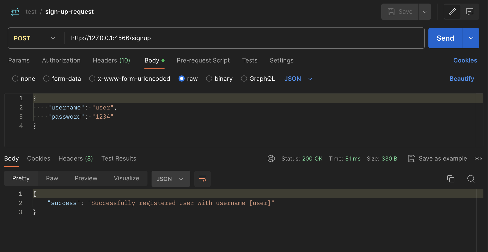
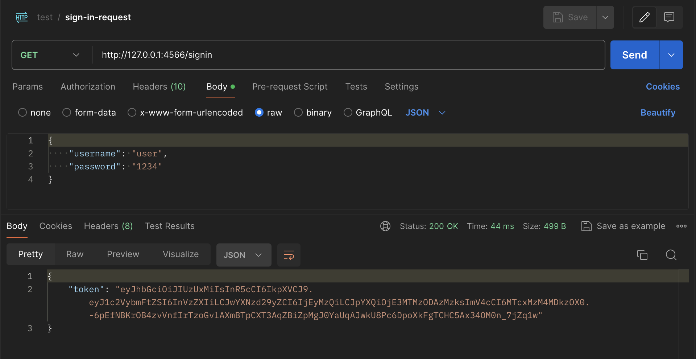
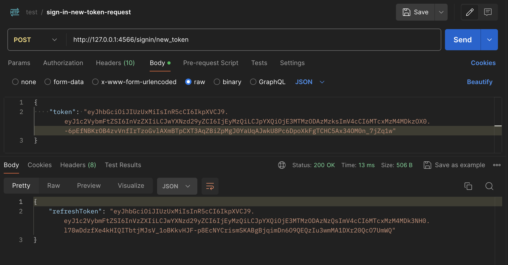
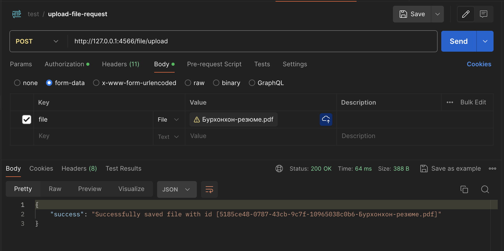
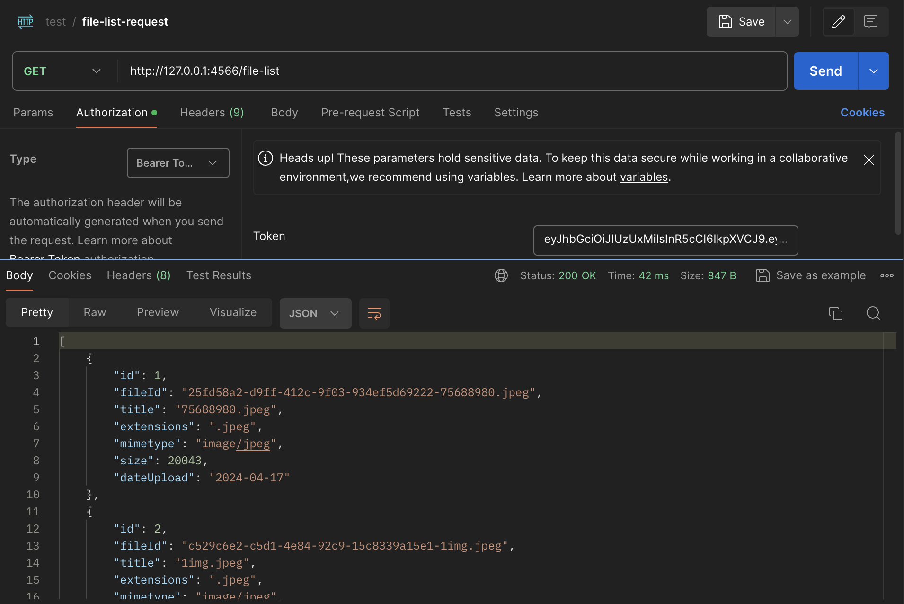
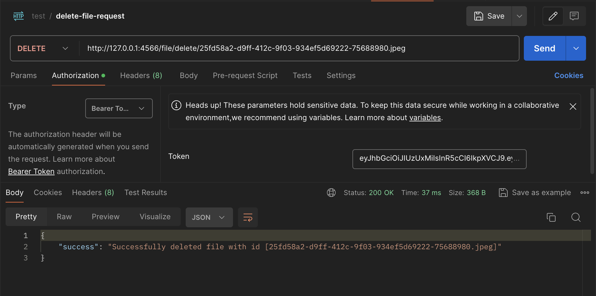
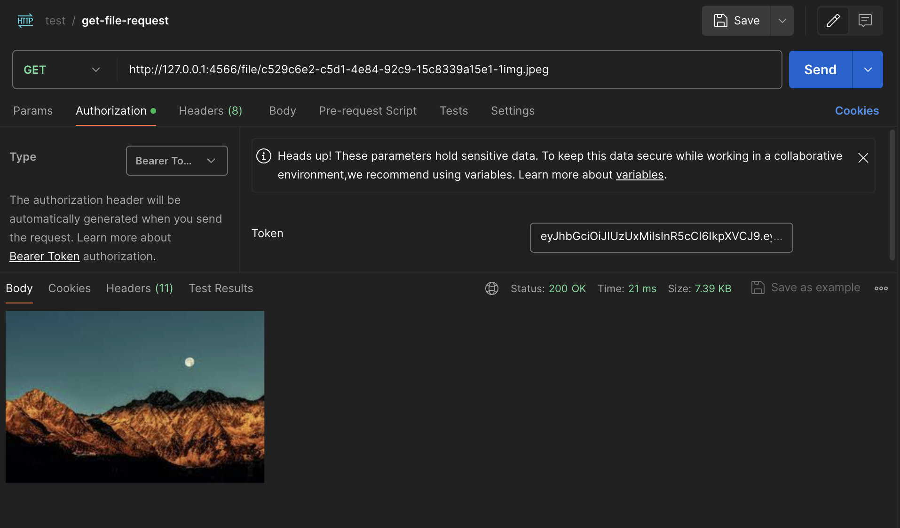
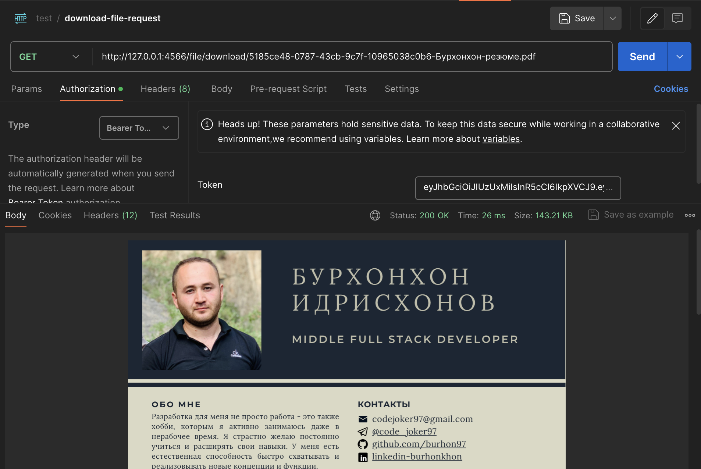
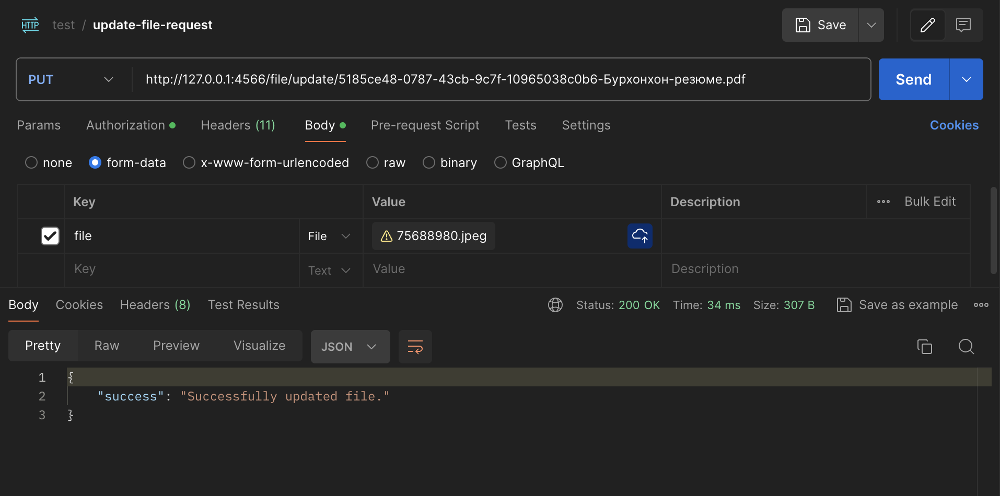
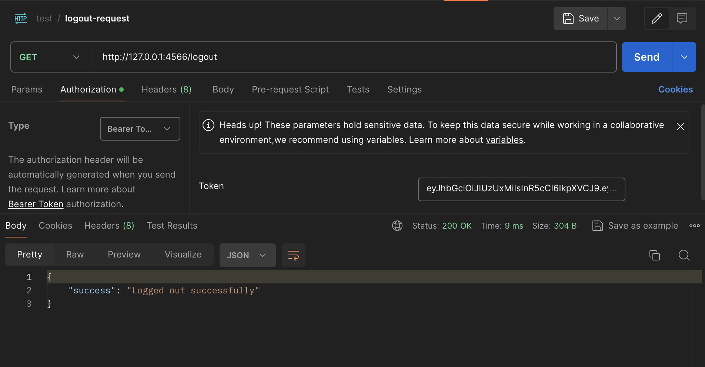

# Express Server

This example `express.js` server for sign-up/sign-in and upload/get/download file.

## Requirements

- [Node.js](https://nodejs.org/en/download)
- [Docker](https://www.docker.com/products/docker-desktop/)

## Installation

```
npm install
```

## Usage

### Run external service with Docker

Create necessary volume by running:

```shell
docker volume create mydb
```

Then run docker-compose to start MySQL:

```shell
docker-compose up -d
```

### Start server

To start server you need at the first compile

```
npm run watch
```

After successfully compiling you can start server

```
npm start
```

### Send request with Postman

Add Postman collection from `./postman_collection.json` directory into [Postman](https://www.postman.com/).

> **NOTE** Check your `Bearer Token`, is it not invalid or revoked.

**`sign-up`**

Make request `sign-up-request` for registration:


**`sign-in`**

Make request `sign-in-request` for sign in and you get your `jwt` token:



**`new-token`**

Make request `sign-in-new-token-request` for refresh `jwt` token:


**`upload-file`**

Make request `upload-file-request` for upload file:


**`list-file`**

Make request `file-list-request` for get list files:


**`delete-file`**

Make request `delete-file-request` for delete file by id:


**`get-file`**

Make request `get-file-request` for get file by id:


**`download-file`**

Make request `download-file-request` for download file by id:


**`update-file`**

Make request `update-file-request` for update file by id:


**`info`**

Make request `info-request` for get info user:


**`logout`**

Make request `logout-request` for logged out (revoke token):

